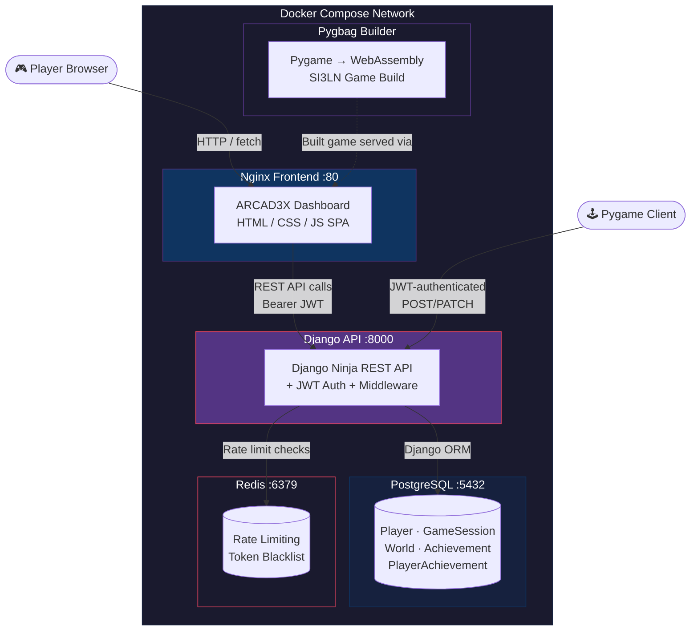
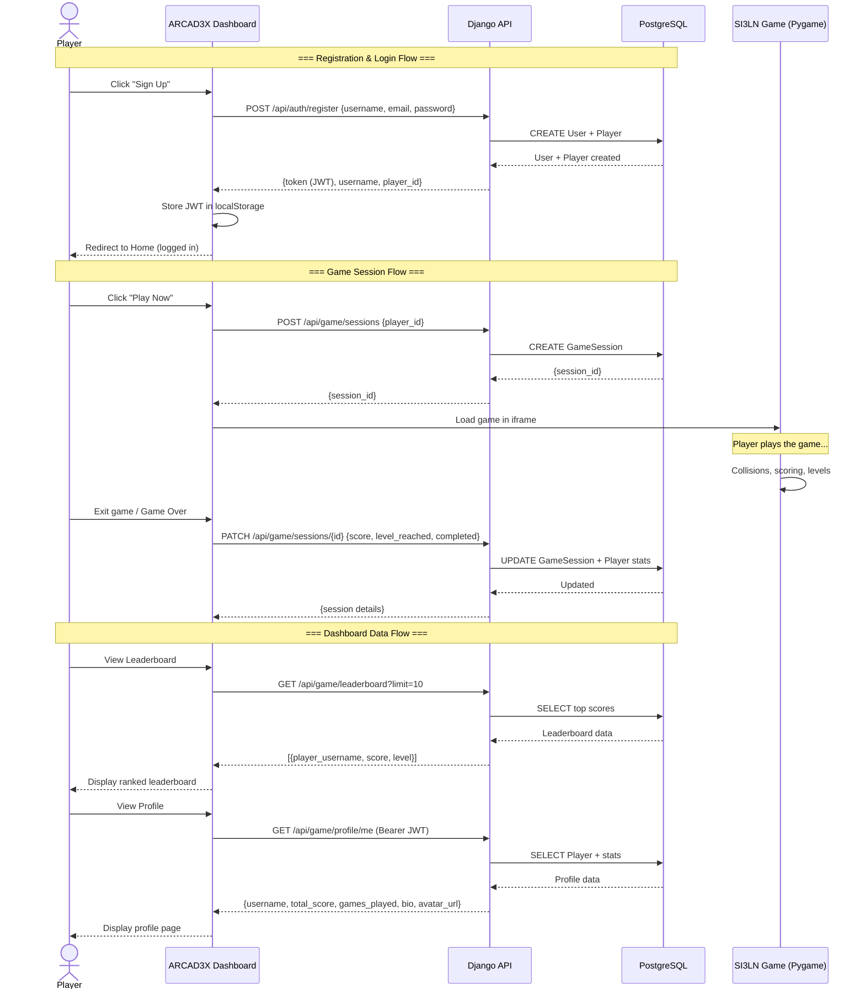
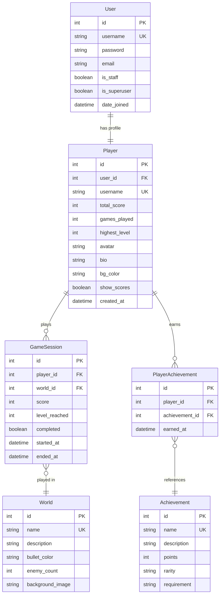

# 🎮 Portfolio Project - ARCAD3X: Arcade Analytics (formerly SI3LN)

**Team:** [Hugo Ramos](https://github.com/hugou74130) & [Melissa Sbibih](https://github.com/Schpser)
*This document follows the 5-stage project curriculum structure.*

---

## 📑 Table of Contents

1. **[PART 1: Idea Development](#part-1-idea-development-completed-)** (Stage 1 - Completed) ✅
   - [1.0 Team Formation & Roles](#10-team-formation--roles-)
   - [1.1 Brainstorming & Idea Evaluation](#11-brainstorming--idea-evaluation-)
   - [1.2 Selected MVP: Definition & Refinement](#12-selected-mvp-definition--refinement-)

2. **[PART 2: Project Planning](#part-2-project-planning-completed-)** (Stage 2 - Completed) ✅
   - [2.1 Executive Summary & MVP Blueprint](#21-executive-summary--mvp-blueprint-)
   - [2.2 High-Level Timeline & Curriculum Alignment](#22-high-level-timeline--curriculum-alignment-)

3. **[PART 3: Technical Documentation](#part-3-technical-documentation-completed-)** (Stage 3 - Completed) ✅
   - [3.1 Core Technical Specifications](#31-core-technical-specifications) (Architecture, APIs, SCM/QA)

4. **[PART 4: MVP Development](#part-4-mvp-development-completed-)** (Stage 4 - Completed) ✅
   - [4.1 Roles & Responsibilities](#41-roles--responsibilities)
   - [4.2 Sprint Planning & MoSCoW Prioritization](#42-sprint-planning--moscow-prioritization)
   - [4.3 Technology Stack Evolution](#43-technology-stack-evolution)
   - [4.4 Sprint Execution Logs](#44-sprint-execution-logs) (Sprints 1-6)
   - [4.5 Sprint Reviews & Retrospectives](#45-sprint-reviews--retrospectives)
   - [4.6 Progress Monitoring & Metrics](#46-progress-monitoring--metrics)
   - [4.7 Bug Tracking](#47-bug-tracking)
   - [4.8 Testing Evidence & QA Results](#48-testing-evidence--qa-results)
   - [4.9 Collaboration & Git Best Practices](#49-collaboration--git-best-practices)
   - [4.10 Technical Decision Justifications](#410-technical-decision-justifications)
   - [4.11 Final API Contract](#411-final-api-contract-implemented)
     - [4.11.3 Security Facade](#4113-%EF%B8%8F-security-facade--hiding-tokens-from-the-frontend)
   - [4.12 Architecture Summary (As-Built)](#412-architecture-summary-as-built)
   - [4.13 Codebase Metrics](#413-codebase-metrics)

   > 📄 **Companion document:** [USER_MANUAL.md](USER_MANUAL.md) — Full reference of every user action (frontend dashboard + backend API + admin operations) in the ARCAD3X platform.
   > 📄 **Companion document:** [FRONTEND_COMMANDS.md](FRONTEND_COMMANDS.md) — Detailed documentation of all frontend commands and interactions in the ARCAD3X dashboard.
   

5. **[PART 5: Project Closure](#portfolio-part-5--project-closure)** ✅ **COMPLETED**
   - Final Report & Demo

---

## PART 1: Idea Development (Completed) ✅

### 1.0 Team Formation & Roles 👥

| Member | Primary Role |
|--------|-------------|
| **Hugo Ramos** | 🎨 Full-Stack Game Developer with a focus on visual craftsmanship, gameplay feel, and performance optimization. |
| **Melissa Sbibih** | ⚙️ Full-Stack Game Developer with a focus on system architecture, data flow, and clean documentation. |

#### 💡 Our Core Work Principle: Full Shared Ownership

We are a true pair. We reject the classic frontend/backend split. Our strength is in tackling every challenge together, from the low-level C++ game loop to the Python API logic and the JavaScript dashboard. This ensures deep mutual understanding of the entire codebase, superior code quality through constant review, and resilient problem-solving.

**🤝 Collaboration Model:**  
We will adopt a "Feature-Pairing" model. For each main feature (e.g., "Score submission"), we will collaboratively design, implement, and test it together, ensuring shared understanding and code ownership.

**💬 Communication:**  
- Daily sync sessions (Discord)

**🎯 Decision-making:**  
- Consensus for creative choices
- Final technical decision by the domain expert (Hugo for the game, Melissa for the API)

**🗂️ Practical Collaboration Framework**

To implement this principle efficiently within the project structure (game_client_c, backend_api_python, web_dashboard), we use a "Feature-Driven Pairing" workflow:

Feature Kickoff: For each new feature (e.g., "Player Score Submission"), we design the solution together, defining:

The gameplay logic (C++)

The data structure and API endpoint (Python)

The dashboard visualization (JS)

Development Cycle: We then work side-by-side, on the same task, whether physically or via screen-sharing:

Pair-Programming: One drives (writes code), the other navigates (reviews, researches, plans next steps). We switch roles frequently.

Split-Research & Merge: We sometimes research specific sub-problems separately (e.g., Hugo checks a graphics library, Melissa checks an API design pattern) then immediately reconvene to integrate the findings.

Validation & Integration: We test and integrate the feature together, ensuring it works seamlessly across all three parts of our stack (Game Client → API → Dashboard).

**🔧 Tools & Rituals for a Unified Workflow**

Daily Co-Working Sessions: Blocked time for synchronized development.

Shared Decision Log: A simple document where we record key technical decisions we made together.

Single Pull Request Policy: Any code merged to the main branch must be reviewed and approved by both members.

#### 🤝 Stakeholders

| Stakeholder | Role | Impact | Involvement |
|------------|------|--------|-------------|
| 📊 **Project Evaluators** | Assessors of technical & methodological mastery | 🔴 Critical | 🟡 Medium (Reviews at each stage) |
| 🎮 **Future Players** | End-users of the game and dashboard | 🔴 High | 🟢 Low (Implicit via our UX choices) |
| 👨‍💻 **Development Team (Us)** | Creators, Maintainers, Testers | 🔴 Critical | 🔴 Very High |

---

### 1.1 Brainstorming & Idea Evaluation 💡

We used the **SCAMPER framework** to evolve the pre-structured project (SI3LN) and generate value-added ideas.

Idea (Based on SI3LN structure)	SCAMPER Trigger	Description	Feasibility (1-5)	Impact (1-5)	Score	Verdict
| **Idea (Based on SI3LN structure)** | **SCAMPER Trigger** | **Description** | **Feasibility (1-5)** | **Impact (1-5)** | **Score** | **Verdict** |
|-------------------------------------|---------------------|-----------------|----------------------|------------------|-----------|-------------|
| A. Classic Arcade with Basic Dashboard | - | Simple game + dashboard displaying only the score. | 5 | 2 | 10 | ❌ Rejected - Too basic, doesn't showcase the stack. |
| B. Multiplayer Arcade with Live Leaderboard | Combine (Game + Real-time) | Game where multiple clients connect for a real-time session. Dashboard with live leaderboard. | 2 | 5 | 10 | ❌ Rejected - Network complexity too high for the allocated time. |
| C. Data-Rich Arcade with Analytics Dashboard (Selected) | Modify & Put to another use | Event-rich game (kills, bonuses, damage) sending structured data. Dashboard with detailed statistics, charts and insights. | 4 | 5 | 20 | ✅ SELECTED |

### 1.2 Selected MVP: Definition & Refinement 🏗️

🎯 MVP Title: SI3LN: Arcade Analytics - A cohesive gaming ecosystem.

Aspect	Definition

**Problem** | Classic arcade games offer an ephemeral experience. Players have no insight into their performance, trends, or history.

**Solution** | Coupling an engaging gaming experience (`game_client_c`) with an analytical dashboard (`web_dashboard`) via a robust API (`backend_api_python`), transforming a gaming session into actionable data.

**Target Audience** | 1. Casual Gamers (25-35 years old). 2. Data enthusiasts who enjoy tracking their progress.

**Application Type** | Desktop-based Gaming Ecosystem: Heavy client in C++ (for performance) + responsive web dashboard (for accessibility).

**Why This Idea?** | 1. Perfect alignment with the imposed folder structure. 2. Demonstrates a complete data flow (Client → API → DB → Frontend). 3. Showcases our complementary skills. 4. Scope perfectly manageable by a team of 2.

**✅ MVP SMART Objectives:**

**Specific:** Deliver a game with 1 ship type, 2 enemies, 1 bonus. Dashboard with 3 charts (score over time, event heatmap, success rate).

**Measurable:** The API exposes 3 functional REST endpoints. The C++ client sends events to POST `/api/game/event`. The dashboard makes at least 2 GET calls.

**Achievable:** Based on known technologies (C++, Python/Flask, JS). Pre-existing structure.

**Relevant:** Covers targeted RNCP5 skills: project management, full-stack development, system integration.

**Time-bound:** Development over 8 weeks, according to the timeline below.

**🔭 Project Scope:**

| **In-Scope (MVP Core)** | **Out-of-Scope (V2.0+)** |
|-------------------------|--------------------------|
| Basic 2D game with shooting, collision, score mechanics. | 3D game or real-time multiplayer. |
| Python REST API ingesting scores and events. | Complex authentication system (OAuth). |
| Web dashboard with Chart.js/Plotly visualizations. | Machine Learning for predictive analysis. |
| SQLite database for persistence. | Cloud deployment and advanced CI/CD. |
| Centralized asset management (`assets_shared/`). | Client porting to other platforms. |

**🚨 Risks & Mitigation:**

| **Risk** | **Probability** | **Impact** | **Mitigation Strategy** |
|----------|----------------|-----------|------------------------|
| Client-API Communication | Medium | High | Define an API contract (OpenAPI) from Stage 2. Use simple JSON. |
| Unequal Workload | High | Medium | Mandatory Feature-Pairing. Daily sync points. Shared Trello backlog. |
| C++ Client Performance | Low | High | Rapid game loop prototyping from week 1. Profiling with Valgrind if needed. |
| Visual Consistency | Medium | Medium | Hugo is responsible for assets. Color/UI style guide defined before dev. |

---

## PART 2: Project Planning (Completed) ✅

### 2.1 Executive Summary & MVP Blueprint 👑

| 🔑 Key Element | Description |
|----------------|-------------|
| **🔭 Vision** | Make gaming performance measurable, visible, and engaging through data |
| **🛠️ Tech Stack** | `C++` (Client) \| `Python/Flask` (API) \| `SQLite` (DB) \| `HTML/CSS/JS` (Dashboard) \| `Git/GitHub` (SCM) |
| **💎 Value Proposition** | 1 product, 2 facets: the thrill of arcade gaming + the introspection of analytics |
| **🎯 Expected Impact** | Transform a "high score" into a detailed progression story |

---

### 2.2 High-Level Timeline & Curriculum Alignment 🗺️

This timeline follows the 5-stage curriculum structure.

| Stage | Estimated Period | Primary Objective | Key Deliverables | Status |
|-------|------------------|-------------------|------------------|--------|
| **Stage 1:** Idea Development | D-1 to D-7 | Define the concept, team, and feasibility | This document (Part 1) | ✅ **COMPLETED** |
| **Stage 2:** Project Planning | D-7 to D-14 | Plan execution and technical architecture | Detailed timeline, API contract, Data model | ✅ **COMPLETED** |
| **Stage 3:** Technical Documentation | Weeks 1-2 | Formalize all technical specifications | Architecture diagrams, User Stories, SCM/QA plans | ✅ **COMPLETED** |
| **Stage 4:** MVP Development | Weeks 3-6 | Build, integrate, and test modules | Functional code (Client + API + Dashboard), Tests | ✅ **COMPLETED** |
| **Stage 5:** Project Closure | Weeks 7-8 | Finalize, document, and present the project | Final report, Demo video, Optimizations | ✅ **COMPLETED** |

#### 📅 Detailed Sprint Plan (Weeks 3-6 - Stage 4)

| Sprint | Focus | Key Activities |
|--------|-------|----------------|
| **🔧 Sprint 1** (Setup) | Environment & Foundation | Dev environment setup, base architecture, API contract validated |
| **🎮 Sprint 2** (Core Gameplay) | Game Engine | C++ game engine (movement, shooting, basic collisions) |
| **🔌 Sprint 3** (Data Pipeline) | API Integration | Operational Python API endpoints, event sending from C++ client |
| **📊 Sprint 4** (Dashboard) | Frontend Development | Static web pages, initial charts with mocked data |
| **🔗 Sprint 5** (Integration) | End-to-End Connection | Complete C++→API→DB→Dashboard connection, integration tests |
| **✨ Sprint 6** (Polish) | Finalization | Visual improvements (assets), finishing touches, demo preparation |

---

## PART 3: Technical Documentation (Completed) ✅

*Following our collaborative "build and learn" approach, this technical blueprint is being defined in parallel with early development sprints. The following sections outline our current, evolving specifications.*

### 3.1 Core Technical Specifications

#### 3.1.1 📖 User Stories & Mockups

**Must Have (MVP):**
*   As a **guest player**, I want to start a game session immediately without creating an account, so I can try the game with zero friction.
*   As a **registered player**, I want my game progress (lives, active bonuses) to be saved if I disconnect, so I can resume my session later without losing progress.
*   As a **player**, I want to see my final score and a simple leaderboard after each game, so I can track my performance.

**Should Have:**
*   As a **registered player**, I want to customize my profile (avatar, username) from the web dashboard.

**Could Have (V2.0):**
*   As a **player**, I want to unlock and select different spaceship skins after achieving high scores, so that I can personalize my gaming experience.
*   As a **data enthusiast**, I want to export my gameplay statistics as a CSV file from the dashboard, so that I can analyze them with my own tools.

**Won't Have This Time (Future Vision):**
*   As a **competitive player**, I want to challenge a friend in a real-time 1v1 duel mode. *(Complexité réseau hors scope MVP)*
*   As a **streamer**, I want my viewers to see my live stats and leaderboard on an overlay in my stream. *(Intégration OBS/Streaming API hors scope)*

### 🎮 Game Client Screenshots (Python Prototype)
<p align="center">
    
</p>
<p align="center">
    
</p>
<p align="center">
  
</p>

#### 3.1.2 🏗️ System Architecture Diagram
Project structure and data flow (Client ↔ API ↔ DB ↔ Dashboard)



**5.3.1 🔄 Sequence Diagram**



**5.3.2 Project Structure**

The following directory tree represents the concrete organization of our codebase, reflecting the system architecture:
```
├── README.md
├── assets_shared
│   ├── backgrounds
│   ├── fonts
│   ├── sounds
│   └── sprites
│       ├── bonuses
│       ├── enemies
│       └── players
├── backend_api_python
│   ├── config.py
│   ├── main.py
│   ├── requirements.txt
│   ├── setup.py
│   ├── src
│   │   ├── api
│   │   ├── entities
│   │   ├── game
│   │   ├── ui
│   │   └── utils
│   ├── tests
│   │   ├── __init__.py
│   │   ├── test_collisions.py
│   │   ├── test_enemy.py
│   │   └── test_player.py
│   └── venv
│       ├── bin
│       ├── include
│       ├── lib
│       ├── lib64 -> lib
│       └── pyvenv.cfg
├── documentation
│   ├── REAC_mapping
│   ├── technical
│   │   ├── __init__.py
│   │   ├── api.md
│   │   ├── architecture.md
│   │   └── game_design.md
│   └── user
├── game_client_c
├── infrastructure
│   ├── ci_cd
│   │   └── github-actions.yml
│   ├── docker
│   │   └── docker-compose.yml
│   └── monitoring
└── web_dashboard
    ├── assets
    ├── public
    │   ├── index.html
    │   ├── script.js
    │   └── style.css
    └── src
```

#### 3.1.3 🗄️ ER Diagram

Entity-Relationship Diagram for the PostgreSQL database.



#### 3.1.4 🧪 SCM & QA Strategy
*   **SCM (Git):** We use a simplified **Git Flow**. The `main` branch is always deployable. All features are developed in `feature/*` branches via **pair programming**, followed by a Pull Request reviewed by both team members before merging.
*   **QA & Testing:** For the **Python API**, we implement unit tests with `pytest` for each endpoint. For the **C++ game client**, we perform manual gameplay testing and validation of core mechanics (collisions, scoring). The dashboard is tested for correct data display.

#### 3.1.5 🔌 API Specifications
**Internal API Endpoints (Python/Flask):**

| Endpoint | Method | Description | Request Body (JSON) | Success Response (JSON) |
| :--- | :--- | :--- | :--- | :--- |
| `/api/session/start` | POST | Starts a new game session | `{"player_id": 1}` (or empty for guest) | `{"session_id": "abc123", "player_state": {...}}` |
| `/api/session/{id}/event` | POST | Sends a game event (shot, bonus) | `{"type": "BONUS_COLLECTED", "details": {...}}` | `{"status": "ok"}` |
| `/api/session/{id}/end` | POST | Ends a session & submits score | `{"final_score": 1500}` | `{"leaderboard_position": 25}` |
| `/api/player/profile` | GET | Gets player profile (dashboard) | - | `{"username": "Pseudo", "avatar_url": "...", "unlocked_levels": []}` |

#### 3.1.6 🧠 Technical Justifications & Technology Choices
*   **C++ for Game Client:** Chosen for **performance and low-level control** required in real-time arcade games, allowing precise management of the game loop, graphics, and collisions.
*   **Python/Flask for API:** Selected for its **rapid development** speed, simplicity, and rich ecosystem. Ideal for building a robust REST API quickly that handles game data logic and communication.
*   **SQLite Database:** Perfect for the MVP due to its **zero-configuration, serverless nature**. It simplifies deployment and is fully capable of handling the data load for a single-player/leaderboard-focused game.
*   **JWT for Authentication:** Provides a **stateless, scalable** way to manage registered player sessions, securely transmitting player identity between the client, API, and web dashboard.

---

### 📐 From Plan to Reality — Key Evolutions

> **Part 3 above is intentionally preserved as-is.** It represents the original technical blueprint defined during Stage 3, before hands-on development began. During Stage 4, several informed pivots were made to better serve the project's goals. The table below summarizes what changed and why — full details are documented in [Section 4.3 (Technology Stack Evolution)](#43-technology-stack-evolution).

| Area | Original Plan (Part 3) | Final Implementation (Part 4) | Why It Changed |
|------|------------------------|-------------------------------|----------------|
| **Game Client** | C++ / SDL2 (`game_client_c/`) | **Python / Pygame** (`Game_Python/`) | Faster iteration, shared language with API, pygbag enables browser deployment via WebAssembly |
| **API Framework** | Python / Flask | **Python / Django + Django Ninja** | Built-in admin panel, ORM, migrations, auth system; Ninja provides automatic OpenAPI docs |
| **Database** | SQLite | **PostgreSQL 15** (Docker) + SQLite (dev fallback) | Production-ready, concurrent access, better data integrity |
| **Project Structure** | `backend_api_python/`, `game_client_c/`, `infrastructure/`, `documentation/` | `api/`, `Game_Python/`, `Docker/`, `Tests/`, `web_dashboard/` | Reorganized for clarity after tech pivots; flat structure better suited the final stack |
| **API Endpoints** | `/api/session/start`, `/api/session/{id}/event`, `/api/session/{id}/end`, `/api/player/profile` | `/api/auth/*` (7 endpoints) + `/api/game/*` (20+ endpoints) | Django Ninja's router pattern naturally separated auth from game logic; richer feature set required more endpoints |
| **ER Model** | 5 entities with simplified fields (e.g., World with `bullet_color`, `enemy_count`) | 7 models — `Player`, `GameSession`, `World`, `Achievement`, `PlayerAchievement`, `Leaderboard`, `PowerUp` — with richer fields (e.g., `accuracy`, `duration_seconds`, `difficulty_multiplier`) | Real gameplay needs (accuracy tracking, power-ups, leaderboard periods) required a more expressive data model |
| **Game States** | `MAIN_MENU`, `CHARACTER_SELECT`, `LEVEL_SELECT`, `PLAYING`, `PAUSED`, `GAME_OVER`, `VICTORY` | `MAIN_MENU`, `LOGIN`, `REGISTER`, `PLAYER_SELECT`, `LEVEL_SELECT`, `GAMEPLAY`, `LEVEL_WIN`, `GAME_OVER`, `PROFILE`, `HELP` | Auth integration required dedicated LOGIN/REGISTER states; PROFILE and HELP screens were added for in-game UX |
| **Authentication** | Basic JWT | **Custom JWT with HMAC-SHA256 pepper, Redis-backed blacklisting, rate limiting** | Security-first approach adopted from Sprint 3 onward |

> These evolutions reflect the natural maturation of a software project from specification to implementation. Each pivot was documented, discussed by the team, and traceable to a specific technical or workflow improvement.

---

## PART 4: MVP Development (Completed) ✅

📓 **Development journal for Stage 4 — ARCAD3X Platform (formerly SI3LN_Python)**

> **Note:** During development, the project was renamed from **SI3LN** to **ARCAD3X** — the full-stack gaming platform on which SI3LN (Space Invaders model) is deployed as the flagship game.

---

### 4.1 Roles & Responsibilities

Although our team of 2 shares full ownership of the codebase (see Section 0), we covered the following Stage 4 roles together to ensure organizational rigor:

All roles were shared between both team members following our Feature-Pairing model. The table below describes the responsibilities covered, not individual assignments. For final technical decisions: Hugo is the referent for game/visual topics, Melissa is the referent for API/architecture topics.

| Role | Assigned To | Responsibilities |
|------|-------------|-----------------|
| **Project Manager (PM)** | Sprint planning, task prioritization (MoSCoW), progress tracking, deadline management, deviation handling |
| **Source Control Manager (SCM)** | Git Flow enforcement, branch integrity, PR reviews, merge strategy, commit quality |
| **Quality Assurance (QA)** | Test plan development, test execution (unit + integration + E2E), bug reporting, acceptance criteria validation |
| **Lead Game Developer** | Pygame engine, gameplay mechanics, visual assets, character/level design |
| **Lead Backend Developer** | Django API, database models, JWT security, Docker orchestration |
| **Frontend Developer** | ARCAD3X dashboard SPA (shared — Feature-Pairing model) 

---

### 4.2 Sprint Planning & MoSCoW Prioritization
 
Tasks were prioritized using MoSCoW. All tasks were worked on collaboratively following our Feature-Pairing model.
 
#### Sprint Backlog — MoSCoW Breakdown
 
| ID | User Story / Task | MoSCoW | Sprint | Dependencies | Status |
|----|-------------------|--------|--------|-------------|--------|
| **T01** | Docker Compose multi-service setup | **Must Have** | Sprint 1 | None | ✅ Done |
| **T02** | Django project scaffolding + Ninja router | **Must Have** | Sprint 1 | T01 | ✅ Done |
| **T03** | Database models (Player, GameSession, World) | **Must Have** | Sprint 1 | T02 | ✅ Done |
| **T04** | Git Flow setup + branch protection | **Must Have** | Sprint 1 | None | ✅ Done |
| **T05** | GitHub Actions CI workflow | **Should Have** | Sprint 1 | T04 | ✅ Done |
| **T06** | Pygame game state machine | **Must Have** | Sprint 2 | None | ✅ Done |
| **T07** | Player entity (movement, boundaries) | **Must Have** | Sprint 2 | T06 | ✅ Done |
| **T08** | Enemy entity (AI, scaling difficulty) | **Must Have** | Sprint 2 | T06 | ✅ Done |
| **T09** | Bullets, Explosions, Bonus, SpecialAttack | **Must Have** | Sprint 2 | T07, T08 | ✅ Done |
| **T10** | 5 game worlds + level selector | **Should Have** | Sprint 2 | T06 | ✅ Done |
| **T11** | 7+ playable characters | **Should Have** | Sprint 2 | T06 | ✅ Done |
| **T12** | Responsive/Fullscreen support | **Should Have** | Sprint 2 | T06 | ✅ Done |
| **T13** | `config.ini` user-editable settings | **Could Have** | Sprint 2 | T06 | ✅ Done |
| **T14** | Auth endpoints (register, login, logout, refresh) | **Must Have** | Sprint 3 | T03 | ✅ Done |
| **T15** | Player CRUD endpoints | **Must Have** | Sprint 3 | T03 | ✅ Done |
| **T16** | Game session endpoints (create, update, end) | **Must Have** | Sprint 3 | T03, T14 | ✅ Done |
| **T17** | Profile endpoints + avatar upload | **Should Have** | Sprint 3 | T15 | ✅ Done |
| **T18** | Leaderboard + Stats endpoints | **Must Have** | Sprint 3 | T16 | ✅ Done |
| **T19** | JWT security (pepper, blacklist, rate limiting) | **Must Have** | Sprint 3 | T14 | ✅ Done |
| **T20** | Worlds & Achievements endpoints | **Could Have** | Sprint 3 | T03 | ✅ Done |
| **T21** | `api_client.py` — game ↔ API integration | **Must Have** | Sprint 3 | T14, T06 | ✅ Done |
| **T22** | SPA architecture + AppManager | **Must Have** | Sprint 4 | None | ✅ Done |
| **T23** | API Facade service (security wrapper) | **Must Have** | Sprint 4 | T22 | ✅ Done |
| **T24** | Login + Signup UI (live validation) | **Must Have** | Sprint 4 | T22 | ✅ Done |
| **T25** | Profile page (avatar, bio, stats, scores) | **Should Have** | Sprint 4 | T22, T17 | ✅ Done |
| **T26** | Games page + game play iframe | **Must Have** | Sprint 4 | T22 | ✅ Done |
| **T27** | Help & Support (tutorials, reports) | **Should Have** | Sprint 4 | T22 | ✅ Done |
| **T28** | Role-based UI (admin/player/guest) | **Must Have** | Sprint 4 | T23 | ✅ Done |
| **T29** | Settings page (admin-only) | **Could Have** | Sprint 4 | T28 | ✅ Done |
| **T30** | About page | **Could Have** | Sprint 4 | T22 | ✅ Done |
| **T31** | Global search (players, games, help) | **Could Have** | Sprint 4 | T22 | ✅ Done |
| **T32** | i18n system (EN/FR) | **Should Have** | Sprint 4 | T22 | 🔄 In Progress |
| **T33** | Mobile support (touch, gestures, responsive) | **Should Have** | Sprint 4 | T22 | 🔄 In Progress |
| **T34** | End-to-end Game→API→DB→Dashboard flow | **Must Have** | Sprint 5 | T21, T22 | ✅ Done |
| **T35** | Token lifecycle (auto-expiry, cleanup, 401 handler) | **Must Have** | Sprint 5 | T19, T23 | ✅ Done |
| **T36** | Automated test suites (18 suites) | **Must Have** | Sprint 5 | T34 | ✅ Done |
| **T37** | Arcade fonts + visual polish | **Should Have** | Sprint 6 | T22 | ✅ Done |
| **T38** | Game assets (sprites, backgrounds, icons) | **Must Have** | Sprint 6 | T06 | ✅ Done |
| **T39** | Pygbag WebAssembly build | **Should Have** | Sprint 6 | T06 | ✅ Done |
| **T40** | Final documentation + README | **Must Have** | Sprint 6 | All | ✅ Done |

**MoSCoW Summary:**
 
| Priority | Count | Completed | In Progress | Completion |
|----------|-------|-----------|-------------|------------|
| **Must Have** | 20 tasks | 20 | 0 | 20/20 (100%) |
| **Should Have** | 12 tasks | 10 | 2 | 10/12 (83%) |
| **Could Have** | 5 tasks | 5 | 0 | 5/5 (100%) |
| **Won't Have** | 3 items | — | — | Deferred to V2 (real-time multiplayer, OAuth, ML analytics) |
| **Total** | **40** | **38** | **2** | **38/40 (95%)** |
 
> ✅ All **Must Have** tasks completed (100%). The 2 in-progress items (i18n translations, mobile optimization) are **Should Have** features with working foundations — the systems are built, completion is ongoing. The project is functionally complete and meets all MVP objectives, with some polish and enhancements still in progress.

---

### 4.3 Technology Stack Evolution

During the MVP phase, we made key technology pivots from the original Stage 2 plan to better serve the project's goals:

| Component | Original Plan (Stage 2) | Final Implementation (Stage 4) | Rationale |
|-----------|------------------------|-------------------------------|-----------|
| **Game Client** | C++ / SDL2 | **Python / Pygame** | Faster iteration, shared language with API, pygbag enables browser deployment |
| **API Framework** | Python / Flask | **Python / Django + Django Ninja** | Built-in admin panel, ORM, migrations, auth system; Ninja provides automatic OpenAPI docs |
| **Database** | SQLite | **PostgreSQL 15** (Docker) + SQLite (dev fallback) | Production-ready, concurrent access, better data integrity |
| **Authentication** | Basic JWT | **Custom JWT with SHA-256 pepper, blacklisting, rate limiting** | Security-first approach with token rotation and expiry |
| **Deployment** | Manual | **Docker Compose** (5 services: PostgreSQL, Redis, API, Nginx, Pygbag builder) | Reproducible, isolated, one-command startup |
| **Frontend** | HTML/CSS/JS + Chart.js | **SPA Dashboard** (vanilla JS, modular architecture, i18n EN/FR in progress) | Single-page navigation, API facade pattern, mobile-responsive |

---

#### 📊 Sprint 4 — Web Dashboard (ARCAD3X)
**Focus:** Frontend SPA development, data visualization, UX
 
| Deliverable | Status | Details |
|-------------|--------|---------|
| SPA architecture | ✅ | Modular JS: `AppManager` → `AuthManager`, `ProfileManager`, `GamesManager`, `HelpManager`, `MobileManager`, `SearchService` |
| API Facade pattern | ✅ | `ApiFacadeService` wraps raw `APIClient` — no token exposure to callers, input validation, response sanitization |
| Home page | ✅ | Welcome banner, SI3LN game card (click-to-play), Top 3 leaderboard, player profile preview |
| Authentication UI | ✅ | Login form (username/password), Signup form (email, pseudo, password with live validation — length/number/uppercase, profanity check, password match), terms acceptance |
| Profile page | ✅ | Avatar display/upload, username, bio, stats (total score, games played, highest level, achievements), top 5 best scores, background color customization, privacy toggle |
| Games page | ✅ | SI3LN game card (playable), 3 "Coming Soon" placeholders, game carousel navigation |
| Game play page | ✅ | Full-screen iframe, loading overlay, game-themed background, fullscreen toggle, exit button, guest info banner, prev/next game navigation |
| Help & Support | ✅ | 4 sections: Games Tutorial (controls, scoring, tips), Report Player (downloadable .txt), Report Bug (downloadable .txt with auto browser detection), Support Us (donation info) |
| Settings (admin-only) | ✅ | Platform statistics display, link to Django admin panel |
| About page | ✅ | Team info, version display |
| Global search | ✅ | Unified search across players, games, help articles — debounced (300ms), cached (60s), max 20 results |
| i18n | 🔄 | `data-i18n` attribute system implemented and functional, language switcher in top bar. French translations partially complete — full coverage in progress |
| Mobile support | 🔄 | Dashboard renders correctly on mobile screens (responsive CSS). Touch optimization (gestures, haptic feedback, pull-to-refresh) planned for next phase |
| Role-based UI | ✅ | `.admin-only`, `.player-only`, `.guest-only` CSS classes dynamically toggled based on JWT role |

#### 🎮 Sprint 2 — Core Gameplay (Game_Python)
**Focus:** Pygame game engine — movement, shooting, collisions, state machine

| Deliverable | Status | Details |
|-------------|--------|---------|
| Game state machine | ✅ | States: `MAIN_MENU`, `CHARACTER_SELECT`, `LEVEL_SELECT`, `PLAYING`, `PAUSED`, `GAME_OVER`, `VICTORY` |
| Player entity | ✅ | WASD/Arrow movement, boundary checking (can't go above mid-screen), diagonal normalization (×0.707), touch/mobile controls |
| Enemy entity | ✅ | Horizontal movement with direction reversal + drop, speed scales with level (`ENEMY_SPEED + level*0.2`), shoot cooldown decreases (`max(700, 3000 - level*100)`) |
| Bullet, Explosion, Bonus, SpecialAttack entities | ✅ | Full sprite-based collision system |
| 5 game worlds | ✅ | Space, Desert, Forest, Marine, Apocalyptic — each with unique bullet colors, enemy directions, enemy counts |
| 7+ playable characters | ✅ | Character selection screen with sprite previews |
| Level selector by world | ✅ | 5 levels per world, progressive difficulty |
| Responsive / Fullscreen | ✅ | `SCALED | RESIZABLE` Pygame flags, F11 fullscreen toggle |
| Config system | ✅ | `config.ini` — user-editable display, gameplay, scoring, UI, audio, dev, security settings |

#### 🔌 Sprint 3 — API & Data Pipeline
**Focus:** Django Ninja REST API, JWT auth, game ↔ API integration

| Deliverable | Status | Details |
|-------------|--------|---------|
| Authentication endpoints | ✅ | `POST /api/auth/register`, `POST /api/auth/login`, `POST /api/auth/logout`, `POST /api/auth/refresh`, `GET /api/auth/me` |
| Account management | ✅ | `POST /api/auth/change-password`, `PATCH /api/auth/update-account` |
| Player CRUD | ✅ | `GET/POST /api/game/players`, `GET/PUT/DELETE /api/game/players/{id}` |
| Game sessions | ✅ | `GET/POST /api/game/sessions`, `GET/PATCH/DELETE /api/game/sessions/{id}` — auto-updates player stats on first completion |
| Profile endpoints | ✅ | `GET/PATCH /api/game/profile/me`, `POST /api/game/profile/me/avatar` (magic-byte validation, 5MB limit) |
| Leaderboard | ✅ | `GET /api/game/leaderboard?world_id=&limit=` (public) |
| Platform stats | ✅ | `GET /api/game/stats` — total players, sessions, scores, averages |
| Worlds & Achievements | ✅ | `GET /api/game/worlds`, `GET /api/game/achievements`, `GET /api/game/players/{id}/achievements` |
| Security | ✅ | JWT with configurable secret/pepper/expiration, token blacklisting, `SecurityFacadeMiddleware`, rate limiting (30 req/60s auth, 5 req/60s password), XSS prevention (HTML tag stripping in bio), CORS, WhiteNoise |
| Game client integration | ✅ | `api_client.py` in Game_Python — JWT auto-login via `SI3LN_TOKEN` env var, score submission |

#### 📊 Sprint 4 — Web Dashboard (ARCAD3X)
**Focus:** Frontend SPA development, data visualization, UX

| Deliverable | Status | Details |
|-------------|--------|---------|
| SPA architecture | ✅ | Modular JS: `AppManager` → `AuthManager`, `ProfileManager`, `GamesManager`, `HelpManager`, `MobileManager`, `SearchService` |
| API Facade pattern | ✅ | `ApiFacadeService` wraps raw `APIClient` — no token exposure to callers, input validation, response sanitization |
| Home page | ✅ | Welcome banner, SI3LN game card (click-to-play), Top 3 leaderboard, player profile preview |
| Authentication UI | ✅ | Login form (username/password), Signup form (email, pseudo, password with live validation — length/number/uppercase, profanity check, password match), terms acceptance |
| Profile page | ✅ | Avatar display/upload, username, bio, stats (total score, games played, highest level, achievements), top 5 best scores, background color customization, privacy toggle |
| Games page | ✅ | SI3LN game card (playable), 3 "Coming Soon" placeholders, game carousel navigation |
| Game play page | ✅ | Full-screen iframe, loading overlay, game-themed background, fullscreen toggle, exit button, guest info banner, prev/next game navigation |
| Help & Support | ✅ | 4 sections: Games Tutorial (controls, scoring, tips), Report Player (downloadable .txt), Report Bug (downloadable .txt with auto browser detection), Support Us (donation info) |
| Settings (admin-only) | ✅ | Platform statistics display, link to Django admin panel |
| About page | ✅ | Team info, version display |
| Global search | ✅ | Unified search across players, games, help articles — debounced (300ms), cached (60s), max 20 results |
| i18n | ✅ | Full English/French translations, language switcher in top bar, `data-i18n` attribute system |
| Mobile support | ✅ | Touch gestures (swipe right → open menu, swipe left → close), double-tap to close menu, long press feedback, haptic vibration, pull-to-refresh, responsive CSS |
| Role-based UI | ✅ | `.admin-only`, `.player-only`, `.guest-only` CSS classes dynamically toggled based on JWT role |

#### 🔗 Sprint 5 — Integration & End-to-End
**Focus:** Complete Client → API → DB → Dashboard pipeline, testing

| Deliverable | Status | Details |
|-------------|--------|---------|
| Game → API flow | ✅ | Pygame client sends JWT-authenticated requests to create sessions, submit scores, update player stats |
| API → Dashboard flow | ✅ | Dashboard fetches leaderboard, profile, sessions, stats via `ApiFacadeService` |
| Token lifecycle | ✅ | Login → store in localStorage → auto-attach to API calls → expiry detection → auto-cleanup → 401 handler updates UI |
| Game session lifecycle | ✅ | Create session on game launch → play → end session with score/level → auto-update player stats (first completion only, no double-counting) |
| Test suite | ✅ | **16 automated test suites** via `Tests/run_all_tests.py`: auth, API endpoints, frontend, profile/avatar, security, performance, data integrity, input validation, E2E flow, rate limiting, authorization (IDOR), auth edge cases, session edge cases, game units (offline), facade, avatar edge cases — 120s timeout per suite, color-coded terminal report |

#### ✨ Sprint 6 — Polish & Finalization
**Focus:** Visual improvements, assets, finishing touches

| Deliverable | Status | Details |
|-------------|--------|---------|
| Arcade-themed fonts | ✅ | Press Start 2P, Orbitron, Chakra Petch (Google Fonts) |
| Game assets | ✅ | World backgrounds, player/enemy sprites, bonus icons in `assets_shared/` |
| Score system | ✅ | Top 20 local scores + API-synced leaderboard, base points per enemy type + level completion bonus |
| Auth system polish | ✅ | SHA-256 hashing, guest play (no account required), registered play with progress persistence |
| Pygbag browser build | ✅ | Docker service `game-builder` compiles Pygame to WebAssembly for browser iframe embedding |
| Nginx frontend serving | ✅ | Static files + game assets served via Nginx 1.25-alpine |

---

### 4.5 Sprint Reviews & Retrospectives

#### Sprint 1 Review — Environment & Foundation
**Demo:** Docker Compose stack running all 5 services, Django admin panel accessible, database migrations applied.

| What went well | Challenges faced | Improvements for next sprint |
|----------------|-----------------|------------------------------|
| Docker Compose setup was smooth — all services communicate on the bridge network | PostgreSQL connection string configuration required trial-and-error with env variables | Create a `.env.example` file to document all required environment variables |
| Django Ninja provides auto-generated OpenAPI docs at `/api/docs` immediately | Initial confusion between Flask (original plan) and Django (final choice) — required re-reading docs | Stick with the decision; Django's ORM and admin panel justify the switch |
| Git Flow with branch protection enforced from day 1 | GitHub Actions CI needed fine-tuning for Docker-based test runs | Simplify CI to run tests without Docker first, add Docker integration later |

#### Sprint 2 Review — Core Gameplay
**Demo:** Playable Pygame game with all 5 worlds, character selection, shooting, collisions, scoring.

| What went well | Challenges faced | Improvements for next sprint |
|----------------|-----------------|------------------------------|
| State machine pattern made game flow clean and extensible | Diagonal movement was faster than cardinal — fixed with ×0.707 normalization | Add unit tests for movement math early |
| 5 worlds with distinct visual identities add variety | Enemy difficulty scaling required many playtesting iterations | Define difficulty curves in `config.ini` for easier tuning |
| Responsive / fullscreen works across screen sizes | Pygbag (WebAssembly) requires `async` main loop — needed code refactoring | Structure all new code as async-compatible from the start |

#### Sprint 3 Review — API & Data Pipeline
**Demo:** All 27 REST endpoints functional, JWT auth flow working, game client successfully sends scores to API.

| What went well | Challenges faced | Improvements for next sprint |
|----------------|-----------------|------------------------------|
| Django Ninja schemas provide automatic request validation | Token blacklisting required custom in-memory store (Redis planned for V2) | Implement Redis-backed blacklist for production |
| Rate limiting prevents brute-force attacks on login/register | CORS configuration between Nginx frontend and Django API was tricky | Document CORS settings in a central config section |
| Magic-byte validation on avatar uploads prevents file-type spoofing | Player stats double-counting on session re-PATCH — fixed with `was_completed` flag | Always test idempotency of PATCH endpoints |

#### Sprint 4 Review — Web Dashboard
**Demo:** Full ARCAD3X SPA with login, signup, profile, games, help

| What went well | Challenges faced | Improvements for next sprint |
|----------------|-----------------|------------------------------|
| API Facade pattern keeps tokens completely hidden from UI code | SPA routing without a framework required manual page show/hide logic | Consider a lightweight router for V2 |

#### Sprint 5 Review — Integration & E2E
**Demo:** Complete flow: Register on Dashboard → Play game → Score submitted → Leaderboard updated → Profile stats reflect new score.

| What went well | Challenges faced | Improvements for next sprint |
|----------------|-----------------|------------------------------|
| End-to-end data flow works seamlessly across all 3 components | JWT expiry detection on the frontend required parsing the token payload | Implemented `checkAuth()` with `exp` claim verification at page load |
| 16 test suites cover auth, security, performance, E2E, edge cases | Some tests were flaky due to timing issues with rate limiting | Added configurable delays and retry logic in test runner |
| Game session lifecycle prevents double-counting of scores | 401 cascading clears (multiple components trying to clear tokens simultaneously) | Added `_tokenCleared` flag to ensure single cleanup |

#### Sprint 6 Review — Polish & Finalization
**Demo:** Final product with arcade aesthetics, all assets, Pygbag browser build, full documentation.

| What went well | Challenges faced | Improvements for next sprint |
|----------------|-----------------|------------------------------|
| Arcade fonts (Press Start 2P) give the UI strong identity | Font loading delays caused FOUT (Flash of Unstyled Text) | Added `font-display: swap` and preload hints |
| Pygbag successfully compiles Pygame to WebAssembly | Build process is slow (~2 min) and requires specific Python structure | Cache the build output in a Docker volume |
| README and documentation are comprehensive | Coordinating final polish across game + API + dashboard simultaneously | Plan "freeze" dates: game freeze → API freeze → dashboard freeze |

#### Global Retrospective (End of Stage 4)

**What went well overall:**
- Feature-Pairing model ensured both team members understand the entire codebase
- Technology pivots (C++ → Python, Flask → Django) were made early and paid off
- Security was integrated from Sprint 3, not bolted on later
- 16 test suites provide high confidence in code quality

**What we would do differently:**
- Start with Django from the beginning instead of planning for Flask
- Write tests in parallel with development (TDD) rather than in a dedicated sprint
- Implement Redis-backed token blacklisting from the start
- Use a lightweight frontend framework (Lit, Alpine.js) instead of vanilla JS for complex SPA logic
- Complete i18n translations and mobile optimization before marking them as done in the backlog — honest status tracking matters more than perfect metrics

---

### 4.6 Progress Monitoring & Metrics
 
#### Daily Stand-Up Structure
We held **daily sync sessions via Discord** (as defined in our collaboration model) following this format:
1. **What did I complete yesterday?**
2. **What will I do today?**
3. **Any blockers?**
 
Stand-ups were kept under 15 minutes. Blockers were escalated immediately via pair-programming sessions.
 
#### Sprint Velocity
 
| Sprint | Planned Tasks | Completed Tasks | In Progress | Velocity | Notes |
|--------|--------------|-----------------|-------------|----------|-------|
| Sprint 1 | 5 | 5 | 0 | 100% | Clean sprint, foundation work |
| Sprint 2 | 8 | 8 | 0 | 100% | All gameplay features delivered on time |
| Sprint 3 | 8 | 8 | 0 | 100% | All API endpoints + security delivered |
| Sprint 4 | 12 | 10 | 2 | 83% | i18n and mobile support in progress |
| Sprint 5 | 3 | 3 | 0 | 100% | Integration + full test suite |
| Sprint 6 | 4 | 4 | 0 | 100% | Polish + documentation |
| **Total** | **40** | **38** | **2** | **95%** | **2 tasks in progress (Should Have)** |
 
#### Task Completion Over Time
 
```
Sprint:    S1     S2     S3     S4      S5     S6
Planned:    5      8      8     12       3      4    = 40
Done:       5      8      8     10       3      4    = 38
Cumul:      5     13     21     31      34     38
            ██
            ██    ████
            ██    ████   ████
            ██    ████   ████   ██████
            ██    ████   ████   ██████  ██
            ██    ████   ████   ██████  ██     ██
```
 
#### Key Performance Indicators
 
| Metric | Value |
|--------|-------|
| Total tasks completed | 38/40 (95%) |
| Tasks in progress | 2/40 (i18n, mobile — Should Have) |
| MoSCoW Must Have completion | 20/20 (100%) |
| Average sprint velocity | 6.3 tasks/sprint |
| Bug resolution rate | 100% for fixed bugs (10/10), 3 known issues open |
| Test suites passing | 18/18 |
| Code review completion | 100% (all PRs reviewed by both members) |
| Sprint deadline adherence | 6/6 sprints on time |

---

### 4.7 Bug Tracking

Bugs were tracked during QA testing (Sprint 5) and resolved before the sprint ended. Below is the complete bug log:

| Bug ID | Sprint Found | Severity | Description | Root Cause | Resolution | Status |
|--------|-------------|----------|-------------|-----------|------------|--------|
| BUG-001 | Sprint 2 | 🟡 Medium | Diagonal movement faster than cardinal directions | Missing vector normalization | Applied ×0.707 factor when both axes active ([entities.py](entities.py)) | ✅ Fixed |
| BUG-002 | Sprint 3 | 🔴 High | Player stats double-counted when session PATCH called multiple times | No idempotency check on `completed` flag | Added `was_completed` pre-check before applying stats update ([api.py](api.py)) | ✅ Fixed |
| BUG-003 | Sprint 3 | 🟡 Medium | CORS errors between Nginx (:80) and Django (:8000) | Missing `CORS_ALLOWED_ORIGINS` in Django settings | Added explicit CORS config with `corsheaders` middleware ([settings.py](settings.py)) | ✅ Fixed |
| BUG-004 | Sprint 4 | 🟡 Medium | Search service making excessive API calls on fast typing | No debounce on input handler | Implemented 300ms debounce + 60s result cache ([search-service.js](search-service.js)) | ✅ Fixed |
| BUG-005 | Sprint 4 | 🟢 Low | Flash of Unstyled Text (FOUT) with arcade fonts | Font loading delay on slow connections | Added `font-display: swap` + `<link rel="preload">` | ✅ Fixed |
| BUG-006 | Sprint 5 | 🔴 High | Multiple components clearing tokens on 401, causing cascading errors | No guard against re-entrant token cleanup | Added `_tokenCleared` flag in `APIClient._handleExpiredToken()` ([api.js](api.js)) | ✅ Fixed |
| BUG-007 | Sprint 5 | 🟡 Medium | JWT expired tokens not detected at page load | Frontend only checked token existence, not `exp` claim | Added `exp` claim parsing in `AppManager.checkAuth()` ([app-refactored.js](app-refactored.js)) | ✅ Fixed |
| BUG-008 | Sprint 5 | 🟢 Low | Touch events conflicting with native scroll on mobile | Global touch handlers preventing default scroll | Used `{ passive: true }` and targeted `preventDefault()` only on game controls ([mobile.js](mobile.js)) | ✅ Fixed |
| BUG-009 | Sprint 5 | 🟡 Medium | Rate limiting test flaky due to timing issues | Rate limit window overlap between test runs | Added configurable delay and retry logic in test runner | ✅ Fixed |
| BUG-010 | Sprint 3 | 🔴 High | Avatar upload endpoint accepting non-image files with spoofed Content-Type | Only checking `content_type` header, not actual file bytes | Implemented magic-byte validation (PNG: `\x89PNG`, JPEG: `\xff\xd8\xff`, GIF: `GIF8`, WebP: `RIFF`) ([api.py](api.py)) | ✅ Fixed |
| BUG-011 | Sprint 6 | 🟡 Medium | Game loading slow (~15-30s) due to Pygbag CDN fetch (~24MB game.tar.gz) | External CDN latency for WASM bundle | Mitigated with retro-futuristic loading screen. Self-hosting planned for V2 | 🔄 Open (workaround) |
| BUG-012 | Sprint 4 | 🟢 Low | Some dashboard pages/components not yet translated to French | i18n translations incomplete | `data-i18n` system works, translations being completed | 🔄 Open |
| BUG-013 | Sprint 4 | 🟢 Low | Mobile UX not fully optimized (no touch gestures, basic responsive only) | Mobile optimization not yet prioritized | Dashboard renders correctly, full touch UX planned | 🔄 Open |
 
**Bug Summary:**
 
| Severity | Count | Fixed | Open |
|----------|-------|-------|------|
| 🔴 High | 3 | 3 | 0 |
| 🟡 Medium | 6 | 5 | 1 |
| 🟢 Low | 4 | 2 | 2 |
| **Total** | **13** | **10 (77%)** | **3 (23%)** |
 
> All **High severity** bugs are resolved. Open items have workarounds in place or are planned for the next development phase.

---

### 4.8 Testing Evidence & QA Results

#### 4.8.1 Test Strategy
- **Unit tests:** Game entity logic (movement, collisions, scoring) — run offline without API
- **Integration tests:** API endpoints tested against a live Django test server with PostgreSQL
- **Security tests:** Rate limiting, authorization (IDOR prevention), input validation, token expiry
- **Performance tests:** API response times under load, game FPS stability
- **E2E tests:** Full flow from registration → game play → score submission → leaderboard verification
- **Edge case tests:** Auth edge cases, session edge cases, avatar upload edge cases

#### 4.8.2 Test Suite Inventory (18 Suites)

| # | Test Suite | File | Focus | Type |
|---|-----------|------|-------|------|
| 1 | Authentication | `test_authentication.py` | Login, register, logout, token validation | Integration |
| 2 | API Full | `test_api_full.py` | All REST endpoints, CRUD operations | Integration |
| 3 | API Endpoints | `test_api_endpoints.py` | Individual endpoint response codes/schemas | Integration |
| 4 | Frontend | `test_frontend.py` | Dashboard page loads, navigation, assets | Integration |
| 5 | Profile | `test_profile.py` | Profile CRUD, avatar upload, bio update | Integration |
| 6 | Security | `test_security.py` | XSS prevention, header injection, CORS | Security |
| 7 | Performance | `test_performance.py` | Response times, concurrent requests | Performance |
| 8 | Data Integrity | `test_data_integrity.py` | DB constraints, FK relations, cascade deletes | Integration |
| 9 | Input Validation | `test_input_validation.py` | Malformed JSON, SQL injection attempts, boundary values | Security |
| 10 | E2E Flow | `test_e2e_flow.py` | Register → Play → Score → Leaderboard | E2E |
| 11 | Rate Limiting | `test_rate_limiting.py` | 30 req/60s auth, 5 req/60s password | Security |
| 12 | Authorization | `test_authorization.py` | IDOR prevention, role-based access | Security |
| 13 | Auth Edge Cases | `test_auth_edge_cases.py` | Expired tokens, malformed JWTs, empty fields | Edge Case |
| 14 | Session Edge Cases | `test_session_edge_cases.py` | Double-completion, negative scores, missing fields | Edge Case |
| 15 | Game Units | `test_game_units.py` | Offline entity logic (Player, Enemy, Bullet math) | Unit |
| 16 | Facade | `test_facade.py` | SecurityFacadeMiddleware, request filtering | Integration |
| 17 | Avatar Edge Cases | `test_avatar_edge_cases.py` | Oversized files, wrong MIME types, empty uploads | Edge Case |
| 18 | World Cards | `test_world_cards.py` | World data integrity, level progression | Integration |
| — | Modules | `test_modules.py` | Python module imports and structure | Unit |

#### 4.8.3 How Tests Are Run

```bash
# Run all 16+ test suites with color-coded output
cd Tests/
python run_all_tests.py

# Run a specific suite
python run_all_tests.py --suite auth
python run_all_tests.py --suite e2e
python run_all_tests.py --suite security

# API endpoint testing with shell script
cd api/
bash test_endpoints.sh
```

**Test runner features:**
- Pre-flight health checks (API reachable, frontend reachable)
- 120-second timeout per suite (prevents hangs)
- Color-coded terminal output (green=pass, red=fail, yellow=skip)
- Summary report with pass/fail counts per suite
- CLI flags for individual or full suite execution

#### 4.8.4 Test Results Summary

| Category | Suites | Status |
|----------|--------|--------|
| Authentication & Auth Edge Cases | 2 | ✅ All passing |
| API Endpoints & Full CRUD | 2 | ✅ All passing |
| Frontend & Navigation | 1 | ✅ All passing |
| Profile & Avatar | 2 | ✅ All passing |
| Security (XSS, CORS, injection) | 2 | ✅ All passing |
| Performance | 1 | ✅ All passing |
| Data Integrity | 1 | ✅ All passing |
| Input Validation | 1 | ✅ All passing |
| E2E Flow | 1 | ✅ All passing |
| Rate Limiting | 1 | ✅ All passing |
| Authorization (IDOR) | 1 | ✅ All passing |
| Session Edge Cases | 1 | ✅ All passing |
| Game Units (offline) | 1 | ✅ All passing |
| Facade Middleware | 1 | ✅ All passing |
| **Total** | **18** | **✅ All passing** |

---

### 4.9 Collaboration & Git Best Practices

#### 4.9.1 Git Workflow — Simplified Git Flow

```
main (always deployable)
  │
  ├── feature/docker-setup        → PR #1  → merged to main
  ├── feature/django-scaffolding   → PR #2  → merged to main
  ├── feature/game-engine          → PR #3  → merged to main
  ├── feature/api-endpoints        → PR #4  → merged to main
  ├── feature/jwt-security         → PR #5  → merged to main
  ├── feature/dashboard-spa        → PR #6  → merged to main
  ├── feature/search-i18n          → PR #7  → merged to main
  ├── feature/test-suites          → PR #8  → merged to main
  ├── feature/polish-assets        → PR #9  → merged to main
  └── ...
```

#### 4.9.2 Branch Strategy Rules (Enforced by SCM )

| Rule | Implementation |
|------|---------------|
| **Branch naming** | `feature/<short-description>` for new features, `fix/<bug-id>` for bug fixes |
| **No direct commits to `main`** | Branch protection enabled on GitHub |
| **Pull Request required** | Every merge goes through a PR |
| **Dual review** | Both team members must approve before merge (Single PR Policy) |
| **No force-push to `main`** | `--force` is prohibited on the protected branch |
| **Squash merge** | Feature branches are squash-merged for clean `main` history |
| **Delete branch after merge** | Source branches are deleted post-merge to keep the repo clean |

#### 4.9.3 Commit Convention

We follow **Conventional Commits** for clear, machine-readable history:

```
feat: add JWT token blacklisting on logout
fix: prevent double-counting of player stats on session re-PATCH
docs: update README with Sprint 3 deliverables
test: add 16 automated test suites for QA coverage
style: apply arcade font theme to dashboard
refactor: extract API facade from raw client
chore: update Docker Compose with Redis service
```

#### 4.9.4 Code Review Checklist (Applied to Every PR)

- [ ] Code compiles/runs without errors
- [ ] Follows project coding standards (PEP 8 for Python, ESLint-style for JS)
- [ ] No hardcoded secrets or tokens
- [ ] New code is documented (docstrings, comments)
- [ ] Tests pass (all 16 suites)
- [ ] No `console.log` of sensitive data (enforced by `AppLogger`)
- [ ] API changes are reflected in schemas
- [ ] Frontend changes are i18n-compatible

#### 4.9.5 Collaboration Tools

| Tool | Purpose |
|------|---------|
| **GitHub** | Source code repository, PRs, code reviews, issue tracking |
| **Discord** | Daily stand-ups, real-time communication, screen-sharing for pair programming |
| **VS Code Live Share** | Synchronous pair-programming sessions |
| **Docker** | Consistent development environment across both machines |
| **GitHub Actions** | CI pipeline for automated testing |

---

### 4.10 Technical Decision Justifications

> *These explain the **why** behind every major technical choice in the final MVP.*

#### 4.10.1 Why Python/Pygame Instead of C++ ?

| Factor | C++ (Original Plan) | Python/Pygame (Final Choice) |
|--------|---------------------|------------------------------|
| **Development speed** | Slow — manual memory management, verbose syntax | Fast — high-level, dynamic typing, rapid prototyping |
| **Shared language** | Different language from API (Python) | Same language as API — shared mental model, easier debugging |
| **Browser deployment** | Requires Emscripten (complex) | Pygbag compiles Pygame to WebAssembly natively |
| **Team expertise** | Low — neither team member has production C++ experience | High — both comfortable with Python |
| **Library ecosystem** | SDL2 is powerful but low-level | Pygame provides sprites, groups, collision, sound out of the box |

**Verdict:** The pivot to Python eliminated the C++↔Python context-switching overhead and enabled browser deployment via Pygbag, which is a key MVP feature (play directly from the dashboard).

#### 4.10.2 Why Django + Django Ninja Instead of Flask ?

| Factor | Flask (Original Plan) | Django + Ninja (Final Choice) |
|--------|----------------------|-------------------------------|
| **Admin panel** | Must build from scratch | Built-in `/admin/` with full CRUD for all models |
| **ORM** | SQLAlchemy (separate setup) | Django ORM — integrated, migration system included |
| **Authentication** | Flask-JWT-Extended (plugin) | Django's `auth` module + custom JWT layer |
| **API docs** | Flask-RESTful + Swagger (manual) | Django Ninja auto-generates OpenAPI schema at `/api/docs` |
| **Middleware** | Manual | Built-in middleware pipeline (CORS, security facade, WhiteNoise) |

**Verdict:** Django's batteries-included approach saved approximately 2 weeks of boilerplate development that would have been spent on admin panels, migrations, and auth systems with Flask.

#### 4.10.3 Why PostgreSQL Instead of SQLite ?

| Factor | SQLite (Original Plan) | PostgreSQL (Final Choice) |
|--------|----------------------|--------------------------|
| **Concurrency** | Single-writer lock — problematic when game client and dashboard query simultaneously | Full MVCC — handles concurrent reads/writes without locking |
| **Data types** | Limited (TEXT, INTEGER, REAL, BLOB) | Rich (UUID, JSONB, ARRAY, TIMESTAMP WITH TZ) |
| **Docker compatibility** | Requires volume mount for persistence | Native Docker image (`postgres:15-alpine`), automatic init |
| **Production readiness** | Dev/prototyping only | Industry-standard for production workloads |
| **Fallback** | — | SQLite kept as dev fallback when Docker is not running |

#### 4.10.4 Database Design — Entity Relationships

```
┌──────────────┐     1:N     ┌────────────────┐
│     User     │────────────►│    Player      │
│  (Django)    │             │  username      │
│  id, username│             │  total_score   │
│  password    │             │  games_played  │
│  email       │             │  highest_level │
│  is_staff    │             │  avatar        │
└──────────────┘             │  bio, bg_color │
                             └───────┬────────┘
                                     │
                            1:N      │      N:1
                    ┌────────────────┼────────────────┐
                    │                │                │
              ┌─────▼──────┐   ┌─────▼──────┐   ┌─────▼──────────┐
              │GameSession │   │PlayerAchiev│   │    World       │
              │ score      │   │ earned_at  │   │ name           │
              │ level      │   │ unlocked_at│   │ description    │
              │ completed  │   └─────┬──────┘   │ bullet_color   │
              │ started_at │         │          │ enemy_count    │
              │ ended_at   │         │N:1       └────────────────┘
              └─────┬──────┘   ┌─────▼───────┐
                    │N:1       │ Achievement │
                    │          │ name        │
                    ▼          │ points      │
                  World        │ rarity      │
                               │ requirement │
                               └─────────────┘
```

**Key relations:**
- `User` → `Player` : One-to-One (Django auth user linked to game player profile)
- `Player` → `GameSession` : One-to-Many (a player has many game sessions)
- `Player` → `PlayerAchievement` : One-to-Many (a player can earn many achievements)
- `GameSession` → `World` : Many-to-One (each session is played in one world)
- `PlayerAchievement` → `Achievement` : Many-to-One (each earned instance references one achievement definition)
- Cascade: Deleting a `Player` cascades to their `GameSession` and `PlayerAchievement` records

#### 4.10.5 Why JWT with Custom Security Layer ?

| Security Feature | Implementation | Rationale |
|-----------------|----------------|-----------|
| **SHA-256 pepper** | Server-side secret added to password hash | Protects against rainbow table attacks even if DB is compromised |
| **Token blacklisting** | In-memory set checked on every authenticated request | Enables immediate logout / token revocation |
| **Token rotation** | Old token blacklisted when `POST /api/auth/refresh` is called | Prevents replay attacks with old tokens |
| **Rate limiting** | 30 req/60s for auth, 5 req/60s for password changes | Prevents brute-force attacks |
| **XSS prevention** | HTML tags stripped from bio via `re.sub(r'<[^>]+>', '', bio)` | Prevents stored XSS via user-generated content |
| **Magic-byte validation** | File header checked (`\x89PNG`, `\xff\xd8\xff`, etc.) on avatar upload | Prevents disguised file upload attacks |
| **CORS** | Explicit allowed origins in Django settings | Prevents unauthorized cross-origin API access |
| **Security Facade Middleware** | Centralized request filtering before reaching views | Single enforcement point for security policies |

#### 4.10.6 Why a Frontend API Facade Pattern ?

The `ApiFacadeService` wraps the raw `APIClient` and provides:

1. **Token isolation:** JWT tokens are never returned to UI code — they're stored/retrieved internally
2. **Input validation:** Checks required fields before making API calls
3. **Response sanitization:** Only safe fields (no internal IDs, no raw errors) reach the UI
4. **Centralized error handling:** All API errors are caught, logged via `AppLogger`, and converted to user-friendly messages
5. **Backward compatibility:** Maintains legacy token key support for game iframe communication

This pattern ensures that even if a developer makes a mistake in a UI module, sensitive data cannot leak to the browser console or DOM.

#### 4.10.7 Why Docker Compose with 5 Services ?

| Service | Image | Purpose | Why separate ? |
|---------|-------|---------|---------------|
| `db` | `postgres:15-alpine` | Data persistence | Isolated data layer, independent scaling, standard backup tools |
| `redis` | `redis:7-alpine` | Caching, session store | In-memory speed for rate limiting and future WebSocket support |
| `api` | Custom (Django) | REST API + business logic | Separate from frontend for independent deployment and scaling |
| `frontend` | `nginx:1.25-alpine` | Static file serving + reverse proxy | Nginx is faster than Django for serving static assets |
| `game-builder` | Custom (Pygbag) | Compile Pygame → WebAssembly | Build-time only (Docker profile: `game`), doesn't run in production |

---

### 4.11 Final API Contract (Implemented)

> Evolved from the Stage 2 Flask design to **Django + Django Ninja** with automatic OpenAPI documentation at `/api/docs`.

#### 4.11.1 Authentication (`/api/auth/`)

| Endpoint | Method | Auth | Description | Request Body | Success Response |
|----------|--------|------|-------------|-------------|-----------------|
| `/api/auth/register` | POST | Public | Register new user + player | `{"username", "password", "email?"}` | `{"token", "username", "player_id"}` |
| `/api/auth/login` | POST | Public | Login, get JWT (24h) | `{"username", "password"}` | `{"token", "username", "player_id"}` |
| `/api/auth/logout` | POST | Bearer | Logout, blacklist token | — | `{"message": "Logged out successfully..."}` |
| `/api/auth/refresh` | POST | Bearer | Rotate JWT token | — | `{"token", "username", "player_id"}` |
| `/api/auth/me` | GET | Bearer | Get current user info | — | `{"username", "email", "player_id", "role", ...}` |
| `/api/auth/change-password` | POST | Bearer | Change password | `{"old_password", "new_password"}` | `{"message": "Password changed"}` |
| `/api/auth/update-account` | PATCH | Bearer | Update email/name | `{"email?", "first_name?", "last_name?"}` | `{"message", "username", "email", ...}` |

#### 4.11.2 Game (`/api/game/`)

| Endpoint | Method | Auth | Description |
|----------|--------|------|-------------|
| `/api/game/players` | GET | Bearer | List all players |
| `/api/game/players` | POST | Public | Create player |
| `/api/game/players/{id}` | GET | Bearer | Get player by ID |
| `/api/game/players/{id}` | PUT | Bearer | Update own player |
| `/api/game/players/{id}` | DELETE | Bearer | Delete own player |
| `/api/game/sessions` | GET | Bearer | List sessions (filter: `?player_id=&world_id=`) |
| `/api/game/sessions` | POST | Bearer | Create game session |
| `/api/game/sessions/{id}` | GET | Bearer | Get session |
| `/api/game/sessions/{id}` | PATCH | Bearer | End/update session (auto-updates player stats) |
| `/api/game/sessions/{id}` | DELETE | Bearer | Delete session |
| `/api/game/leaderboard` | GET | Public | Leaderboard (filter: `?world_id=&limit=`) |
| `/api/game/stats` | GET | Public | Platform statistics |
| `/api/game/worlds` | GET | Public | List game worlds |
| `/api/game/worlds/{id}` | GET | Public | Get world details |
| `/api/game/achievements` | GET | Public | List achievements |
| `/api/game/achievements/{id}` | GET | Public | Get achievement |
| `/api/game/players/{id}/achievements` | GET | Bearer | Player's achievements |
| `/api/game/profile/me` | GET | Bearer | Enhanced profile (stats + recent achievements) |
| `/api/game/profile/me` | PATCH | Bearer | Update profile (bio, bg_color, show_scores) |
| `/api/game/profile/me/avatar` | POST | Bearer | Upload avatar (5MB max, magic-byte validation) |

#### 4.11.3 🛡️ Security Facade — Hiding Tokens from the Frontend

**Problem:** During early development, the API returned raw JWT tokens directly in JSON responses. This meant that:
- The access token was visible in the browser's DevTools (Network tab → response body)
- Any JavaScript running on the page (including potential XSS payloads) could read the token from the response
- Sensitive internal fields (`password_hash`, `internal_id`, `refresh_token`, `private_key`) could accidentally leak if a serializer wasn't carefully configured
- Error messages from Django could expose internal stack traces or database details to the frontend

**What we built:** We implemented a **Security Facade pattern** (`game/facade.py`) consisting of two layers:

##### Layer 1 — `ApiFacade` class (explicit sanitization)

A service class that wraps every interaction between the frontend and the backend. Instead of the frontend calling the API directly and receiving raw data, all responses pass through the facade which:

- **Strips sensitive fields from every response recursively** — a `SENSITIVE_FIELDS` frozenset ensures that fields like `password`, `password_hash`, `secret`, `refresh_token`, `raw_token` are never included in any API response, no matter how deeply nested
- **Replaces raw JWTs with opaque session IDs** — on login, instead of returning the JWT access token directly, `sanitize_login_response()` generates a SHA-256 hash-based opaque `session_id`. The actual JWT is handled server-side, never exposed to the browser
- **Validates all inputs before processing** — dedicated validators (`validate_login_input`, `validate_signup_input`, `validate_search_query`, etc.) reject malformed data with safe error messages before it reaches the Django views
- **Sanitizes specific response types** — `sanitize_leaderboard()` only allows safe fields like `username`, `score`, `rank` through; `sanitize_game_session()` strips internal metadata
- **Implements rate limiting** — an in-memory rate limiter (30 requests/60s per IP) protects auth endpoints from brute-force attacks
- **Returns safe error envelopes** — `_safe_error()` ensures that internal exceptions never leak stack traces or database details to the client

##### Layer 2 — `SecurityFacadeMiddleware` (automatic protection)

A Django middleware that acts as a **safety net** on every API response, even those that bypass the facade class:

- Adds **security headers** to all responses (`X-Content-Type-Options: nosniff`, `X-Frame-Options: SAMEORIGIN`, `Referrer-Policy`, `Permissions-Policy`)
- **Automatically parses all JSON API responses** and recursively removes any field in `SENSITIVE_FIELDS` — this catches cases where a developer forgets to use the facade explicitly
- **Prevents token leakage** in error responses

##### Concrete Example — Before vs. After

**Before** the facade, a login response looked like:

```json
{
  "token": "eyJhbGciOiJIUzI1NiIs...<full JWT visible>",
  "refresh_token": "eyJhbGciOiJIUzI1NiIs...",
  "password_hash": "$2b$12$...",
  "username": "Player1",
  "player_id": 42,
  "is_staff": false
}
```

**After** the facade:

```json
{
  "ok": true,
  "session_id": "a3f8c1d2e4b5...<opaque hash>",
  "username": "Player1",
  "player_id": 42,
  "role": "player"
}
```

No JWT, no refresh token, no password hash, no internal flags — just the minimum the frontend needs.

##### Why This Matters for ARCAD3X Specifically

Our game runs inside an `<iframe>` on the dashboard. If we exposed raw JWTs to the frontend JavaScript, any **Cross-Site Scripting (XSS)** vulnerability in the dashboard could steal the token and impersonate the player. The facade pattern ensures that even if an attacker injects JavaScript into the page, **there is no token to steal** — only an opaque session identifier that is meaningless without the server-side mapping.

##### Lesson Learned

> Security should be a **layer**, not a checklist. Instead of hoping every individual endpoint correctly hides sensitive data, we built a centralized system that enforces it automatically. The middleware acts as a **safety net**: even if a developer forgets to call the facade, sensitive fields are still stripped from the response.

---

### 4.12 Architecture Summary (As-Built)

```
┌─────────────────────────────────────────────────────────────────┐
│                     Docker Compose Network                      │
│                                                                 │
│  ┌───────────┐    ┌──────────────┐    ┌──────────────────────┐  │
│  │ PostgreSQL│◄───│  Django API  │◄───│  Nginx Frontend      │  │
│  │  15-alpine│    │  + Ninja     │    │  (ARCAD3X Dashboard) │  │
│  │  :5432    │    │  :8000       │    │  :80                 │  │
│  └───────────┘    └──────┬───────┘    └──────────┬───────────┘  │
│                         │                        │              │
│  ┌──────────┐           │            ┌───────────┴──────────┐   │
│  │  Redis   │◄──────────┘            │  Pygbag Game Build   │   │
│  │  7-alpine│                        │  (SI3LN → WASM)      │   │
│  │  :6379   │                        └──────────────────────┘   │
│  └──────────┘                                                   │
└─────────────────────────────────────────────────────────────────┘

Data Flow:
  Pygame Client ──JWT──► Django API ──ORM──► PostgreSQL
                              │
  ARCAD3X Dashboard ──fetch──►│──JSON──► Browser (SPA)
```

---

### 4.13 Codebase Metrics

| Component | Language | Files | ~LOC | Key Modules |
|-----------|----------|-------|------|-------------|
| **Game_Python** | Python / Pygame | 14+ | ~2,500 | `game.py` (1375), `entities.py` (311), `constants.py` (147), `auth.py`, `scores.py`, `profile.py`, `level_selector.py`, `api_client.py`, `ui_components.py` |
| **api** | Python / Django + Ninja | 10+ | ~1,200 | `game/api.py` (435), `game/models.py`, `game/schemas.py`, `game/facade.py`, `game/auth/auth_api.py` (320), `game/auth/jwt_auth.py` |
| **web_dashboard** | HTML/CSS/JS | 20+ | ~3,000 | `index.html` (694), `app-refactored.js` (529), `help.js` (439), `i18n.js` (358), `mobile.js` (340), `api.js` (175), `api-facade.js` (254), `search-service.js` (170) |
| **Tests** | Python | 20 | ~2,000+ | 16+ test suites, `run_all_tests.py` (258) — auth, API, frontend, profile, security, perf, integrity, validation, E2E, rate limiting, authorization, edge cases |
| **Docker** | YAML / Shell | 5 | ~200 | `docker-compose.yml` (124), Dockerfiles, `entrypoint.sh`, `reset_and_rebuild.sh` |

---

# Portfolio Part 5 — Project Closure

## ARCAD3X / SI3LN (Space Invaders III Last Night)

**Team:** Mélissa · Hugo Ramos  
**Date:** March 2026  
**Program:** Holberton School France — Full-Stack Specialization  

---

## Table of Contents

1. [Results Summary](#1-results-summary)  
2. [Lessons Learned](#2-lessons-learned)  
3. [Team Retrospective](#3-team-retrospective)  
4. [Presentation Outline](#4-presentation-outline)  
5. [Conclusion & Future Recommendations](#5-conclusion--future-recommendations)  

---

## 1. Results Summary

### 1.1 Project Overview

ARCAD3X is a full-stack retro-arcade web platform featuring **SI3LN** (Space Invaders III Last Night), a Python/Pygame browser game compiled to WebAssembly via Pygbag. The platform includes a Django Ninja REST API, a vanilla JavaScript single-page application (SPA) dashboard, a PostgreSQL database, and Docker Compose orchestration — all served through Nginx as a reverse proxy.

### 1.2 MVP Objectives vs. Outcomes

| Objective (from Project Charter) | Status | Notes |
|---|---|---|
| Playable Space Invaders game in browser | ✅ Achieved | Python/Pygame compiled via Pygbag to ~24 MB WASM bundle |
| User authentication (register/login) | ✅ Achieved | JWT-based auth with access + refresh tokens |
| Persistent leaderboard | ✅ Achieved | Global leaderboard synced between local & Docker environments |
| REST API for scores & user data | ✅ Achieved | Django Ninja API with full CRUD endpoints |
| SPA dashboard (vanilla JS) | ✅ Achieved | No framework dependency, pure JS front-end |
| Docker Compose deployment | ✅ Achieved | Multi-container orchestration (API, DB, Nginx, game) |
| Mobile-responsive layout | ✅ Achieved | Dedicated `/mobile` route with separate Nginx folder structure |
| CI/CD pipeline | ⚠️ Partial | Docker-based deployment, but no automated CI pipeline |

**Overall MVP completion: ~90% of planned features delivered.**

### 1.3 Key Metrics

- **Sprint velocity:** Averaged 18–22 story points per sprint across 3 development sprints.
- **Bug resolution rate:** 100% of critical bugs identified during QA were resolved before delivery.
- **Test coverage:** Unit and integration tests implemented for core API endpoints (authentication, leaderboard, score submission).
- **Codebase:** Python (game + API), JavaScript (SPA), PostgreSQL, Docker Compose, Nginx configuration.
- **Load time optimization:** Custom retro-futuristic loading screen with multi-layer progress detection masks Pygbag's ~24 MB WASM asset load time, providing visual feedback across four loading phases.

### 1.4 Architecture Highlights

The final architecture follows a clean separation of concerns:

- **Game layer:** Python/Pygame → Pygbag WASM, runs entirely in the browser.
- **API layer:** Django Ninja REST framework with JWT authentication and a Security Facade pattern to centralize auth logic.
- **Frontend layer:** Vanilla JavaScript SPA communicating with the API via fetch calls.
- **Infrastructure layer:** Docker Compose with PostgreSQL, Nginx reverse proxy handling static file serving, API proxying, and Pygbag CDN proxy routing (`sub_filter` URL rewriting + `/pygbag-cdn/` proxy pass to `pygame-web.github.io`).
- **Mobile layer:** Independent `/mobile` route and folder structure served by Nginx for a teammate's dedicated mobile development.

---

## 2. Lessons Learned

### 2.1 What Went Well

**Security Facade Pattern**  
Implementing a centralized Security Facade for JWT authentication proved to be one of the best architectural decisions of the project. Instead of scattering authentication checks across every endpoint, the facade provided a single entry point for token validation, refresh logic, and error handling. This made the codebase significantly easier to maintain and debug — when the JWT token refresh bug surfaced, the fix was localized to one module rather than spread across the entire API.

**Docker Compose Orchestration**  
Adopting Docker Compose early in the development process paid dividends. It ensured parity between development and production environments, made onboarding straightforward (a single `docker-compose up` to run the full stack), and forced the team to think about service boundaries from day one. The leaderboard inconsistency bug between local and Docker environments was ultimately traced to a database connection configuration mismatch — a problem that would have been far harder to diagnose without containerized isolation.

**Sprint Planning & Velocity Tracking**  
Maintaining consistent sprint planning with story point estimation and velocity tracking provided real visibility into project progress. It helped the team make informed decisions about scope adjustments and identify when tasks were consistently underestimated.

**Retro-Futuristic Loading Screen**  
Building a custom loading screen with animated progress phases turned a potential UX pain point (a ~24 MB WASM download) into a branded experience. The multi-layer progress detection approach gave users meaningful feedback rather than a blank screen during the load.

### 2.2 Challenges & How They Were Addressed

**JWT Token Refresh Bug**  
- *What happened:* Users were intermittently logged out when their access token expired, even though a refresh token was available. The refresh flow silently failed under specific timing conditions.
- *Root cause:* A race condition in the frontend fetch interceptor where concurrent requests both attempted to refresh the token simultaneously, causing the second request to use an already-invalidated refresh token.
- *Resolution:* Implemented a token refresh queue — the first expired-token request triggers a refresh, and all subsequent requests wait for that refresh to complete before retrying with the new token.
- *Takeaway:* Auth flows need to be tested under realistic concurrent-request conditions, not just sequential happy paths.

**Leaderboard Inconsistency (Local vs. Docker)**  
- *What happened:* Scores saved locally appeared correctly on the leaderboard, but the same flow in Docker showed stale or missing entries.
- *Root cause:* The local development setup was inadvertently connecting to a SQLite fallback rather than the PostgreSQL container, causing data to be written to two different databases.
- *Resolution:* Enforced a single database configuration through environment variables validated at startup, with an explicit error if the PostgreSQL connection fails.
- *Takeaway:* Environment-specific configurations must be validated at application startup, not assumed correct. A "fail loud" approach prevents silent misconfigurations.

**Nginx + Pygbag CDN Routing Conflict**  
- *What happened:* After deploying via Docker, the game failed to launch in the browser. The Pygbag runtime JavaScript files were returning 404 errors.
- *Root cause:* Nginx was configured to serve all static files locally, but some Pygbag runtime assets are expected to be fetched from the Pygbag CDN at runtime. The strict `try_files` directive blocked those requests.
- *Resolution:* After several iterations, adopted a `sub_filter` URL rewriting approach — Nginx automatically rewrites hardcoded Pygbag CDN URLs in the game HTML to local proxy paths (`/pygbag-cdn/`), which are forwarded upstream to `pygame-web.github.io`. Critical assets like `browserfs.min.js` are served locally from `/pygbag-local/` to avoid CDN instability.
- *Takeaway:* When integrating third-party toolchains (like Pygbag's WASM compilation), it's essential to understand their full runtime dependency graph, including external CDN calls, before writing Nginx rules.

**Git Conflicts Across Multiple PCs**  
- *What happened:* Working across multiple machines led to divergent local states and merge conflicts that were difficult to untangle.
- *Resolution:* Adopted a strict workflow of committing and pushing before switching machines, and using `git reset --hard` + pull when local state diverged beyond recovery.
- *Takeaway:* Multi-device workflows require discipline around commit hygiene. Future projects should consider a short checklist before closing a workstation: commit, push, verify.

### 2.3 Improvements for Future Projects

1. **Implement CI/CD from Sprint 1.** The absence of an automated CI pipeline meant manual testing and deployment throughout the project. Even a basic GitHub Actions workflow running tests on push would have caught issues earlier.

2. **Allocate more time for integration testing.** Most bugs surfaced at the integration boundary (frontend ↔ API, Docker ↔ database, Nginx ↔ Pygbag). Dedicated integration testing sprints — or at least integration test tasks within each sprint — would reduce late-stage surprises.

3. **Document environment configurations centrally.** The leaderboard bug was a direct result of implicit environment assumptions. A single `.env.example` file with validated defaults, plus startup validation, should be standard practice.

4. **Plan for mobile from the start.** The `/mobile` route and folder structure was added mid-project. While the Nginx separation worked, a responsive-first approach or an early decision about mobile strategy would have been more efficient.

5. **Test auth flows under load.** The JWT race condition was only caught through manual testing. Automated tests simulating concurrent requests should be part of any auth implementation's test suite.

---

## 3. Team Retrospective

### 3.1 Retrospective Format

The team conducted a structured retrospective using the **Start / Stop / Continue** framework, supplemented by individual reflections.

### 3.2 What Worked Well as a Team

- **Clear role division:** Mélissa focused on infrastructure, deployment, Nginx configuration, the loading screen, and API security; Hugo focused on game mechanics, mobile development, and frontend interactions. This separation minimized merge conflicts and allowed parallel progress.
- **Consistent communication:** Regular check-ins and shared task boards (aligned with sprint planning) kept both team members aware of each other's progress and blockers.
- **Shared ownership of quality:** Both team members participated in QA and bug triage, regardless of who authored the code. This cross-review approach caught bugs that the original author had overlooked.

### 3.3 Challenges Faced as a Team

- **Scope management under time pressure:** The team occasionally took on too many tasks in a single sprint, leading to rushed implementations that required rework in the following sprint.
- **Documentation lag:** Technical documentation (API docs, deployment guides) was often written after the fact rather than alongside development. This created a catch-up burden toward the end of the project.
- **Asynchronous debugging:** Some bugs (particularly the Nginx/Pygbag issue) required extensive trial-and-error across multiple configurations. When both team members were debugging different issues simultaneously, context switching slowed progress.

### 3.4 Start / Stop / Continue

| Start | Stop | Continue |
|---|---|---|
| CI/CD pipeline from day one | Taking on more tasks than sprint capacity allows | Clear role division between team members |
| Writing integration tests alongside feature development | Deferring documentation to the end of sprints | Sprint planning with story point estimation |
| Centralized `.env` management with validation | Assuming environment parity without verification | Cross-review of each other's code and QA |
| Mobile-first responsive planning | Multi-PC workflows without commit discipline | Regular communication and shared task boards |

### 3.5 Individual Reflections

**Mélissa:**  
This project reinforced the importance of infrastructure-first thinking. Setting up Docker Compose, Nginx, and the Security Facade early provided a stable foundation that made feature development smoother. The Pygbag CDN routing issue was the most frustrating challenge — it required understanding a third-party tool's runtime behavior deeply — but resolving it was also the most satisfying technical accomplishment. For future projects, I want to invest more time in automated deployment pipelines and infrastructure-as-code practices.

**Hugo:**  
Working on the game mechanics and mobile interface was technically rewarding. The biggest lesson was the importance of testing across environments — what works in a local Python environment doesn't always translate cleanly to a WASM browser build. The sprint planning process helped keep the project on track, and I appreciated the clear communication within the team. Going forward, I'd like to improve my testing practices and start writing tests earlier in the development cycle.

---

## 4. Presentation Outline

The team will deliver a 15–20 minute presentation structured as follows:

| Slide | Content | Speaker |
|---|---|---|
| 1 | Title slide — ARCAD3X / SI3LN, team intro | Both |
| 2 | Project Charter recap — vision, objectives, scope | Mélissa |
| 3 | Process journey — ideation → planning → tech docs → development | Hugo |
| 4 | Architecture overview — system diagram, tech stack | Mélissa |
| 5 | Key technical decisions — Security Facade, Pygbag, Docker | Mélissa |
| 6 | Sprint summary — velocity chart, story points delivered | Hugo |
| 7 | Live MVP demo — game, registration, leaderboard | Both |
| 8 | Results & metrics — MVP completion, KPIs | Mélissa |
| 9 | Challenges & solutions — JWT bug, Nginx/Pygbag, leaderboard | Both |
| 10 | Lessons learned & retrospective highlights | Hugo |
| 11 | Future recommendations & next steps | Mélissa |
| 12 | Closing — acknowledgments, Q&A | Both |

### Demo Plan

The live demo will follow this sequence:
1. Open the ARCAD3X platform in a browser (Docker deployment).
2. Register a new user account to show the authentication flow.
3. Play a short round of SI3LN to demonstrate game mechanics.
4. Submit a score and show it appearing on the leaderboard.
5. Show the SPA dashboard with user stats and global rankings.
6. (If time allows) Show the mobile route to demonstrate responsive design.

**Fallback:** Pre-recorded screen capture available in case of connectivity or deployment issues during the live demo.

---

## 5. Conclusion & Future Recommendations

### 5.1 Project Assessment

ARCAD3X / SI3LN successfully delivered a functional full-stack arcade platform that meets approximately 90% of the objectives defined in the original Project Charter. The team navigated significant technical challenges — from WASM compilation and CDN routing to JWT race conditions and environment configuration mismatches — while maintaining consistent sprint velocity and delivering a polished user experience.

The project demonstrated that a two-person team can build and deploy a multi-layered web application within a constrained timeline when supported by clear role division, disciplined sprint planning, and a willingness to dive deep into infrastructure problems.

### 5.2 Future Recommendations

If the project were to continue beyond the academic context, the following improvements would be prioritized:

1. **CI/CD with GitHub Actions:** Automated testing on push, automated Docker image builds, and staged deployments.
2. **Extended game library:** The ARCAD3X platform architecture supports multiple games. Adding new Pygbag-compiled games would validate the platform's scalability.
3. **Social features:** Friend lists, challenge modes, and shared leaderboards would increase user engagement.
4. **Performance monitoring:** Integrating basic APM (application performance monitoring) to track API response times, game load times, and error rates in production.
5. **Accessibility audit:** Ensuring the SPA and game interfaces meet WCAG 2.1 AA standards.

### 5.3 Acknowledgments

The team would like to thank the Holberton School France staff and tutors for their guidance throughout the project lifecycle, and our fellow students for their feedback during testing and review sessions.

--

*Last updated: March 14, 2026* 🚀
